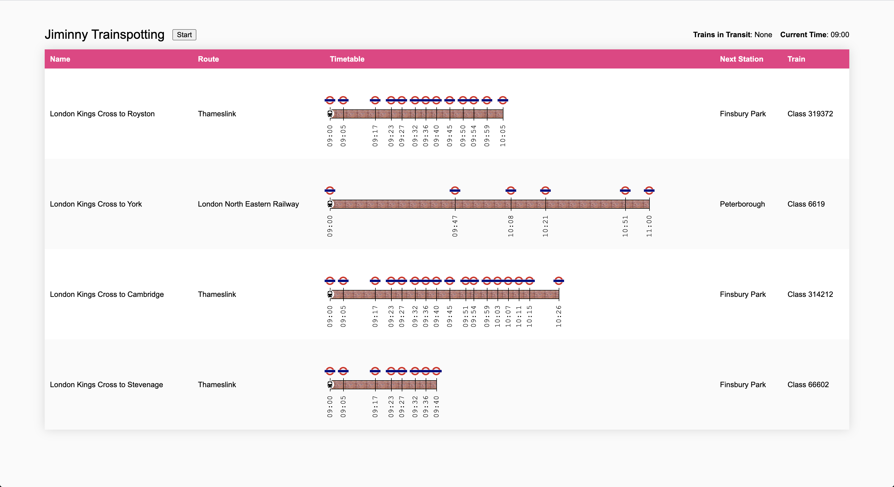
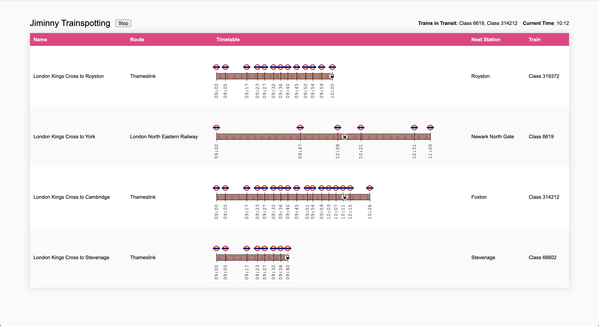
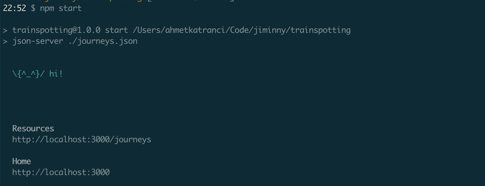
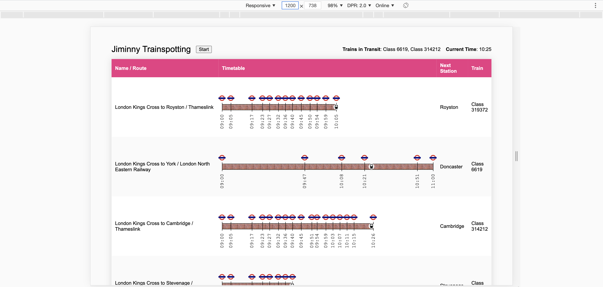

# Jiminny Trainspotting

Jiminny Trainspotting is a web app that is designed to display the timetable of morning rush hour journeys (09:00 to 11:00). All trains start their journeys at 09:00 and none run longer than two hours.

## Header
The header just above the table hosts some information as well as a Start button:
- Start button: It starts the clock, every 500ms corresponds to 1 minute journey time (more about this below)
- Current Time: Shows the current time and gets updated after the Start button is clicked
- Trains in Transit: Shows the name of the trains that are in transit at the current time

## Journeys Table
This table shows 5 pieces of essential information for each journey: Name, Route, Timetable, Next Station, and Train name.

## Start button (Transit Mode)

When the Start button is pressed, the clock starts running, and the following information is updated based on current time:
- Trains in Transit: Name of the trains, seperated by a comma. If there aren't any then it displays None.
- Position of the train icons on each railroad
- Next station column

Also note that the Start button is essentially a toggle button for starting and pausing the clock. So when it is is pressed, it is replaced with a Stop button which allows pausing the clock.

## Journeys Data
You will fetch journey data from a REST service. To start the service run `npm start` after installing npm dependencies. When it starts it outputs the resource URI (e.g. `http://localhost:3000/journeys`)

## Design
### App Layout
* App takes 90% of the screen width and has 30px gaps from top and bottom of the screen.

### Timetable
* Every minute takes 5px width. For example, the railroad width of a 65-minute journey is 325px.
* Each station in the journey is shown by a vertical line, station icon, and departure time.
* Station icon dimension is 20x16 pixels.
* Train icon is in a 16x16 pixels white circle that has 1px padding.
* Departure time is displayed vertically, facing to the right.

### Responsiveness
### 1300px and above
* All 5 columns are displayed separately

### Between 1024px and 1299px

* Name and Route are displayed in a single column named Name / Route

### Under 1024px

* Start button, Trains in Transit, and Current Time are not displayed
* Name and Route columns are separated
* Next Station column is not displayed
* Timetable is displayed as a list of time and station in text
