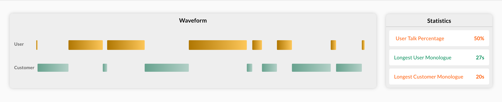

# Waveform Generator (Back-end + Front-end Take-home Task)

The task solves a real-world problem related to converting an audio file into a useful waveform structure. Waveforms are a key way for our customers to visualize speech data.

We recommend writing answers in whatever language you’re most comfortable in. Like our own code, we expect testing instructions: whether it’s an automated test framework, or simple manual steps.

---

## Brief

Write a program to consume the raw output from an audio silence detection [filter](https://ffmpeg.org/ffmpeg-filters.html#silencedetect) and convert it into a useful format for consumption by other APIs. The `ffmpeg` command has been run for a sample call and we've linked the raw data for both the [`user` channel](https://github.com/jiminny/join-the-team/blob/master/assets/user-channel.txt), and the [`customer` channel](https://github.com/jiminny/join-the-team/blob/master/assets/customer-channel.txt).

The files contain data about a real conversation between two parties on a conference call with the following structure:

```
[silencedetect @ 0x7fa7edd0c160] silence_start: 1.84
[silencedetect @ 0x7fa7edd0c160] silence_end: 4.48 | silence_duration: 2.64
[silencedetect @ 0x7fa7edd0c160] silence_start: 26.928
```

For simplicity, the largest point in the dataset represents the total duration of the call.

## Back-end Requirements

1. For each channel, the data needs inverting to show when audio was active and stored as a series of points. This is based off `silence_start` and `silence_end` values. The unit of these values are seconds.
   For example, the above would translate to `[0, 1.84], [4.48, 26.928]`

2. Determine the longest un-interrupted speech (monologue) for each channel (stored as `longest_user_monologue` and `longest_customer_monologue`.

3. Determine the percentage of time the user talked over the entire call duration (stored as `user_talk_percentage`).

4. You'll return the following JSON structure:

```
{
  "longest_user_monologue": 416.18,
  "longest_customer_monologue": 1152.82,
  "user_talk_percentage": 41.92,
  "user":[
    [0,3.504],[6.656,14],[19.712,20.144],[27.264,36.528],[41.728,47.28],[49.792,61.104],[65.024,79.024],
    [ ... and many more ...]
  ],
  "customer":[
    [0,1.84],[4.48,26.928],[29.184,29.36],[31.744,56.624],[58.624,66.992],[69.632,91.184],
    [ ... and many more ...]
  ]
}
```

5. Expose the data to an endpoint with the structure from p. 4. so that the front-end can consume it.

## Front-end Requirements



1. Create a user interface with a waveform widget and statistics panel as in the screenshot above.

2. The **Waveform** represents the `user` and `customer` data. This is the talk time with its `start` and `end` moments.

3. The **Statistics** panel displays 3 metrics. The `longest_user_monologue` and `longest_customer_monologue` are displayed in seconds and `user_talk_percentage` in percentage.

There is color coding applied to the labels with the following rules:

- `User Talk Percentage`: More than 50% - Green (#008c57); Less than 50% - Orange (#ff5800);
- `Longest User Monologue`: Less than 60 seconds - Green (#008c57); More than 60 seconds - Orange (#ff5800);
- `Longest Customer Monologue`: More than 60 seconds - Green (#008c57); Less than 60 seconds - Orange (#ff5800);

## Coding Standards

- Ideally use git to version control the application
- Include instructions in a README on how to run the application

## Submission

Please publish your submission to GitHub or email us a zip or tarball of your prototype.
